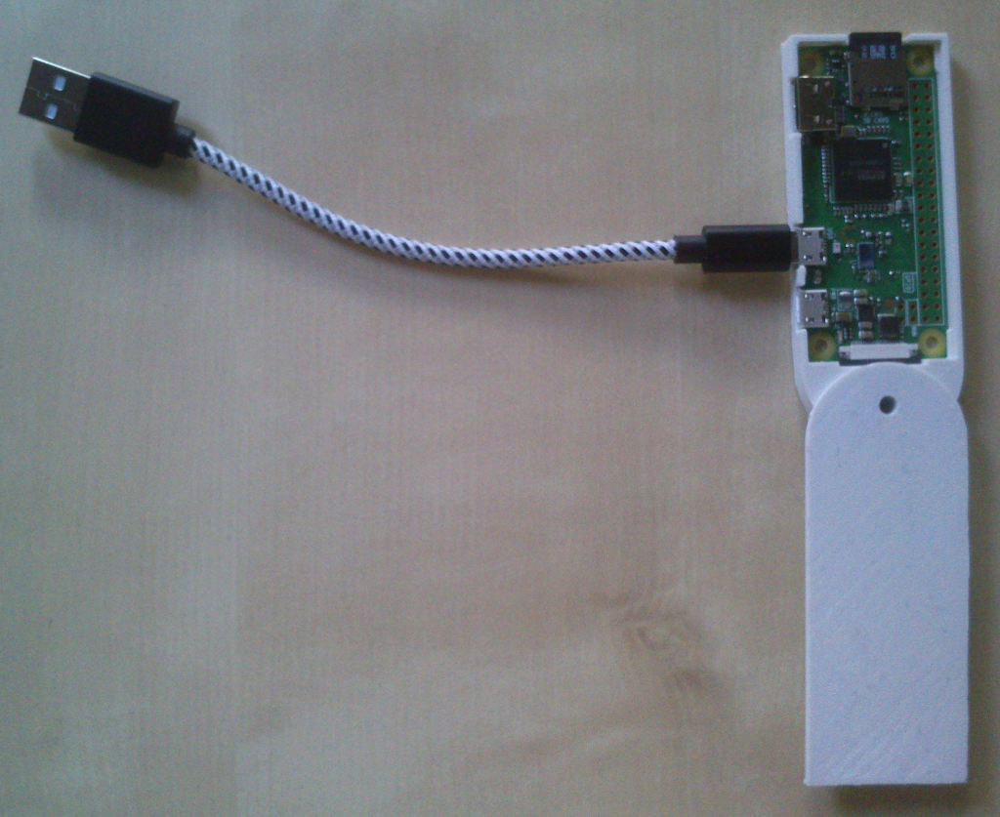

# Project T-1000

## Aim
Build a message signing device so that:

1. The device fits into a pocket.
2. The total cost is around 1000 cent.
3. The hard- and software is open source.
4. The device is as secure as possible.

## WARNING
THIS DOCUMENT DOES NOT CLAIM TO BE COMPLETE!!! THIS IS ONLY A PROOF OF CONCEPT. ONLY STORE IMPORTANT DATA ON THE DEVICE IF YOU KNOW WHAT YOU ARE DOING.

## Introduction
If a person wants to proof its (online) identity without revealing its true identity, modern asymmetric cryptography is essential.
Messages can simply be signed with the private key whose public key is publicly associated to the person's (online) identity.
For instance, the person could publish a bitcoin address on the internet, for which it owns the private key.
Messages signed with the private key can then be verified by others on the internet.
To create such a signed message via bitcoin core is simple and can be done quickly using bitcoin-qt.
In this case, the private key is stored in the wallet.dat file.
The following points are extremly important with respect to the private keys' security:

1. The wallet MUST be encrypted.
2. The home folder must be encrypted.
3. The partition should be encrypted.

However, this does not help, if the wallet was stored in the profile of a normal and the internet browsing user, whose profile or computer might be compromised in one way or another.
Solutions to this problem:

1. Usage of an hardware wallet.
2. Usage of a second computer in the private LAN (without internet connection!) only for handling the private keys.

If the first point applies to you, that is you already own an hardware wallet, then you can stop reading here.
The second point can clearly be a waste of energy, hardware and space, especially, if the second computer does not consist of specific hardware.
This is where project T-1000 comes into play:

T-1000 stands for **Trezer0-1000**, a simple open source and raspberry pi zero based Trezor alternative, small enough to fit into a pocket.

Why using a rasperry pi zero?

1. It is small and has roughly the size of an usb-stick.
2. It is cheap and only costs around 5$.
3. It is a stand-alone computer and thus, as flexible as possible with respect to software and additional hardware.
4. Energy for the device and control over the device are provided via the same usb-connection.

## Material
1. Ubuntu 16.04.03 LTS as desktop OS
2. Raspberry pi zero
3. Micro sd card
4. Usb cable
5. Time
6. 3D-printer (optional)

## Methods

### Install Raspbian
Our starting point is Ubuntu as desktop OS.
There, enter the Download directory:
```
cd /home/<user>/Downloads
```
Download the current version of [Raspbian](https://www.raspberrypi.org/downloads/raspbian/):
```
wget https://downloads.raspberrypi.org/raspbian_latest
```
This will save a file with the name "raspbian_latest", which represents a zip-archive.
Rename it:
```
mv raspbian_latest raspbian_latest.zip
```
Test the sha256-hash of the zip-archive:
```
sha256sum raspbian_latest.zip | grep -o 64c4103316efe2a85fd2814f2af16313abac7d4ad68e3d95ae6709e2e894cc1b
```
If grep returns the hash, everything is fine.
Unzip it:
```
unzip raspbian_latest.zip
```
The current Raspbian image will be unzipped in the Downloads-directory and should look similar to:
```
2017-11-29-raspbian-stretch.img
```
Now insert the micro sd card into your computer, e.g. by means of a mirco sd card adapter.
Check via gparted (sudo apt-get install gparted) which device name the sd card has:
```
sudo gparted
```

BE CAREFUL AND DO NOT MIX THE PARTITIONS, IN THE WORST CASE YOU INSTALL RASPBIAN ON YOUR MAIN PARTITION!

Close gparted.
If you have identified the correct device (something like /dev/sdb or /dev/sdc), write the Raspbian image to the sd card:
```
sudo dd if=2017-11-29-raspbian-stretch.img of=/dev/<the_identified_device>
``` 
Then remove the sd card from the computer and insert it again.
Two new file systems should automatically pop up.
```
cd /media/<user>/boot
```
Do the [following](https://www.thepolyglotdeveloper.com/2016/06/connect-raspberry-pi-zero-usb-cable-ssh/):
```
sudo touch ssh
```
This creates the file "ssh" in the boot directory, which will tell Raspbian to accept ssh connections.
Then edit config.txt in the same directory:
```
sudo nano config.txt
```
Add the following line at the bottom of the file:
```
dtoverlay=dwc2
```
Exit nano via Ctrl+x and press y for accepting the changes.
Also edit cmdline.txt:
```
sudo nano cmdline.txt
```
Find "rootwait" in the file and add
```
modules-load=dwc2,g_ether
```
directly behind it, delimited with exactly one space, but make sure to also keep the other stuff.
The result should look as follows:
```
... rootwait modules-load=dwc2,g_ether quiet ...
```
Exit nano via Ctrl+x and press y for accepting the changes.
Leave the current directory:
```
cd /home/<user>/Downloads
```
Unmount the two file systems on the sd card by right clicking on the corresponding symbols on the unity bar on the left by selecting "Unmount":


Insert the sd card into the raspberry pi zero.
Insert the usb-cable into the micro usb port of the pi, which is closest to the middle.
The device is now ready for its first boot up.

### Connect to raspberry pi zero
Plug the device into an usb-port of your computer and wait around two minutes.
Do a right click on the network manager (I found no working command line based way to connect to the device):


Some of the shown information will double there, but not in a reasoned way (a kind of MS-Windows behavior ...):


Since there is no configured connection to the raspberry pi zero yet, let's create one:
Click on "Edit Connections..." -> "Add" -> "Ethernet" -> "Create" -> "IPv4 Settings" (you can also give the new connection a meaningful name like "t1000").
Now, there are two possible configurations under "Method" we will use:

1. "Link-Local Only"
2. "Shared to other computers"

If the device is not allowed to have an internet connection, then select the first possibility (you will be still able to access the device via ssh).
This configuration is used later on, when the device is readily installed and configured.
However, since Raspbian should be updated and additional software needs to be downloaded, we select the second possibility.
Click "Save" and "Close" and Ubuntu will do the rest.
The resulting network configuration should look similar to this:


In a terminal check:
```
ifconfig
```
This command should show a new ethernet device with an ip assigned.
Now connect to the device via ssh:
```
ssh pi@raspberrypi.local
```
Password is "raspberry" by default.
Note, that Ubuntu seems to have problems to select the correct ethernet connection after its reboot.
That is, Ubuntu mixes up the internet connection with the newly created raspberry pi zero connection.  
Therefore, delete an old raspberry pi zero connection before you insert the device into the usb-port of your computer and then follow the steps of this paragraph from the beginning.

### Configure raspberry pi zero
After logging into the device, do:
```
sudo raspi-config
```
You can browse the [raspi-confi](https://www.raspberrypi.org/documentation/configuration/raspi-config.md) menu via arrow, tab and return keys.
Choose "Expand file system" so that the device will use all of the sd card's memory.
This change will apply after reboot.
Also set the "Localisation options":

1. Set "Change local" to, e.g., "en_GB.UTF-8 UTF-8".
2. Set "Time zone" to the time zone where you are living in.
3. If you use a specific keyboard, also adapt "Change keyboard layout" correspondingly.

Finish the tool.
Then reboot:
```
sudo shutdown -r now
```
After reboot update Raspbian (if there are problems with logging into the device again, see the end of paragraph "Connect to raspberry pi zero"):
```
sudo apt-get update
```
Followed by
```
sudo apt-get dist-upgrade
```
The upgrade procedure will now take some time, grab a coffee, a beer or a glass of wine and do something else in the meantime.

### Compile bitcoin core
Firstly, make sure, which cpu is running the device:
```
cat /proc/cpuinfo
```
My raspberry pi zero is run by an "ARMv6-compatible processor rev 7 (v6l)" so that the bitcoin core binaries won't work.
Thus, we have to [compile](http://raspnode.com/diyBitcoin.html) the software by ourselves.
Secondly, we need much more memory, than the 512 MB the device provides since otherwise compiling will take forever:
```
sudo nano /etc/dphys-swapfile
```
Change the default size of 100 to the maximum number of 2048:
```
CONF_SWAPSIZE=2048
```
Save and exit nano via Ctrl+x and press y for accepting the changes.
Then run:
```
sudo dphys-swapfile setup
sudo dphys-swapfile swapon
```
Reboot:
```
sudo shutdown -r now
```
And after relogin check the swap:
```
top
``` 
Exit top via Ctrl+c.
Thirdly, we need additional packages:
```
sudo apt-get install autoconf libevent-dev libtool libssl-dev libboost-all-dev libminiupnpc-dev git t4-dev-tools libprotobuf-dev protobuf-compiler libqrencode-dev
```
Fourthly, we need Berkeley-DB 4.8, so we have to compile this too:
```
cd /home/pi/Downloads
wget wget http://download.oracle.com/berkeley-db/db-4.8.30.NC.tar.gz
echo "12edc0df75bf9abd7f82f821795bcee50f42cb2e5f76a6a281b85732798364ef db-4.8.30.NC.tar.gz" | sha256sum -c
tar -xzvf db-4.8.30.NC.tar.gz
cd db-4.8.30.NC
cd build_unix
../dist/configure --enable-cxx
make
```
This will take some time but should finish in less than one or two hours.
```
sudo make install
```
If you do not want to install Berkley-DB system-wide see [this](https://forum.feathercoin.com/topic/8168/building-feathercoin/4) as an alternative way of building *coin core. 
Now we are ready for bitcoin core:
```
cd /home/pi/Downloads
git clone https://github.com/bitcoin/bitcoin.git
```
This is a current snapshot of the bitcoin core code.
You can also specify the branch for cloning via "-b":
```
git clone -b 0.15 https://github.com/bitcoin/bitcoin.git
```
Finally, build bitcoin core:
```
cd bitcoin
./autogen.sh
./configure CPPFLAGS="-I/usr/local/BerkeleyDB.4.8/include -O2" LDFLAGS="-L/usr/local/BerkeleyDB.4.8/lib" --enable-upnp-default --with-gui
make
``` 
Building bitcoin core on a single cpu device with 1 GHz, 512 MB ram and 2048 MB swap will take ages.
But you can always stop compilation via Ctrl+c since after shutdown and reboot you can resume compilation via "make". 
The bitcoin directory will be copied or moved to the home of a new user, which we will create in the next section.
The bitcoin binaries can then be accessed locally.
We will also install ecryptfs in the next section so that this directory is safe from modification with respect to the bitcoin core binaries as well as the wallet.dat file.

### Create new default user and encrypt its home folder 
Create a new user as follows:
```
sudo adduser t1000
```
You only need to provide a password, the other information can be left empty.
Also add this user to the sudoers group:
```
sudo adduser t1000 sudo
```
Now install ecryptfs and lsof:
```
sudo apt-get install ecryptfs-utils lsof
sudo modprobe ecryptfs
```
To make this permanent, do:
```
sudo nano /etc/modules-load.d/modules.conf
```
Add the line
```
ecryptfs
```
Exit nano via Ctrl+x and press y for accepting the change.
Now encrypt the home of user t1000 but make sure, that user t1000 is not logged in:
```
sudo ecryptfs-migrate-home -u t1000
```
Save the output of this command in some file for potential later use.
Log out from the device:
```
exit
```
And log in again as user t1000 with the corresponding password:
```
ssh t1000@raspberrypi.local
```
Now reboot:
```
sudo shutdown -r now
```
Log in again as user t1000.
To test wether sudo will work, do:
```
sudo visudo
```
Exit the program via Ctrl+c.
Finally lock the pi user:
```
sudo usermod -L -e 1 pi
```
You can always unlock the pi user via:
```
sudo usermod -U -e 99999 pi
```
From now on, it won't be possible to become the user pi or to log into the device as the user pi.
Copy the whole Download folder from the pi user to t1000's home folder:
```
cp /home/pi/Downloads /home/t1000 -Rf
```
Also note, that ecryptfs will further slow down the device.

### Install firewall
Install [ufw](https://www.digitalocean.com/community/tutorials/how-to-setup-a-firewall-with-ufw-on-an-ubuntu-and-debian-cloud-server):
```
sudo-apt-get install ufw
```
If you configured ufw wrongly, and if you are not able to log into the device again, then mount the sd card on you computer directly and edit the following file:
```
sudo nano /media/<user>/rootfs/etc/ufw/ufw.conf
```
Change the line which controls ufw to:
```
ENABLED=no
```
Exit nano via Ctrl+x and press y for accepting the change.
If you have access to the device, then you can also reset ufw via:
```
sudo ufw reset
```
A working configuration looks as follows:
```
sudo ufw default deny incoming
sudo ufw default allow outgoing
sudo ufw allow ssh
```
NOT WORKING YET:
```
sudo ufw default deny incoming
sudo ufw default deny outgoing
sudo ufw allow ssh
```
Let's close the bitcoin core ports, so that it has no connection to the outer world:
```
sudo ufw deny out 8333
sudo ufw deny out 18333
```
Activate ufw:
```
sudo ufw enable
```
You can deactivate ufw via:
```
sudo ufw disable
```
Let's test bitcoin-qt.
Log out:
```
exit
```
And log in again:
```
ssh t1000@raspberrypi.local -X
```
Start bitcoin-qt via:
```
/home/t1000/Downloads/bitcoin/src/qt/bitcoin-qt
```
Select the default location for the wallet and blockchain, which is:
```
/home/t1000/.bitcoin
```
Close the GUI.

### Configure wallet
Start bitcoind:
```
/home/t1000/Downloads/bitcoin/src/bitcoind &
```
We do not want, that the following commands go into the history.
Therefore the command line must be forced to ignore commands, which start with a space:
```
export HISTCONTROL=ignorespace
```
Make this permanent by adding the line from above to /home/t1000/.bashrc:
```
nano /home/t1000/.bashrc
```
Exit nano via Ctrl+x and press y for accepting the change.
You can check your environment variables after reboot via:
```
env | grep HISTCONTROL
```
If you forget the space, you can always remove the passphrase from history via editing /home/t1000/.bash_history.
Now encrypt your wallet:
```
 /home/t1000/Downloads/bitcoin/src/bitcoin-cli encryptwallet "<passphrase>"
```
Make sure, that there is a space in front of this command!
We do not want to save the wallet passphrase in the history.
Restart the server:
```
/home/t1000/Downloads/bitcoin/src/bitcoind &
```
And create a new address for signing messages:
```
/home/t1000/Downloads/bitcoin/src/bitcoin-cli getnewaddress "" "legacy"
```
For instance in my case, bitcoind returned:
```
1FL4TwFWvhQ9kbjXMtcsupupwcRk61Y6YP
```
Messages signed with the private key associated to this address will now serve as proof of identity.
Clearly, you can also import private keys from other wallets and use those for identity proof.

### Scripts for creating signatures
Create a bin folder in t1000's home:
```
mkdir /home/t1000/bin
```
Firstly, create the file signmessage.sh:
```
nano /home/t1000/bin/signmessage.sh
```
And fill the file with the following code:
```
#!/bin/bash

# start bitcoind and wait five seconds
/home/t1000/Downloads/bitcoin/src/bitcoind & 
sleep 5;

# unlock the wallet for one second
/home/t1000/Downloads/bitcoin/src/bitcoin-cli walletpassphrase "$1" 1;

# sign a message and wait two seconds
signature=$(/home/t1000/Downloads/bitcoin/src/bitcoin-cli signmessage "$2" "$3");
sleep 2;

# stop bitcoind
/home/t1000/Downloads/bitcoin/src/bitcoin-cli stop &> /dev/null;

# print signed message
echo "-----BEGIN BITCOIN SIGNED MESSAGE-----";
echo "$3";
echo "-----------BEGIN SIGNATURE------------";
echo "$2";
echo "$signature";
echo "------END BITCOIN SIGNED MESSAGE------";
```
Change the permissions of this file:
```
chmod 700 /home/t1000/bin/signmessage.sh
```
Test the script as follows:
```
 /home/t1000/bin/signmessage.sh "<walletpassphrase>" "1FL4TwFWvhQ9kbjXMtcsupupwcRk61Y6YP" "hello world"
```
Again make sure, that the command begins with a space!
In my case, the script returns after around thirty seconds with:
```
-----BEGIN BITCOIN SIGNED MESSAGE-----
hello world
-----------BEGIN SIGNATURE------------
1FL4TwFWvhQ9kbjXMtcsupupwcRk61Y6YP
ICEfpWSTZsmlqW38kZTaYuhub4jY+V9K9Dsv13LSEk5EFLWfbKr3zQtpgxL22kSEiXKQRp+Mb/rINtzFsBMXGVo=
------END BITCOIN SIGNED MESSAGE------
```
Secondly, create the file verifymessage.sh:
```
nano /home/t1000/bin/verifymessage.sh
```
And fill the file with the following code:
```
#!/bin/bash

# start bitcoind and wait five seconds
/home/t1000/Downloads/bitcoin/src/bitcoind & 
sleep 5;

# verify message and stop bitcoind
/home/t1000/Downloads/bitcoin/src/bitcoin-cli verifymessage "$1" "$2" "$3";
/home/t1000/Downloads/bitcoin/src/bitcoin-cli stop &> /dev/null;
```
Change the permissions of this file:
```
chmod 700 /home/t1000/bin/verifymessage.sh
```
You can now also verify a message as follows:
```
/home/t1000/bin/verifymessage.sh "1FL4TwFWvhQ9kbjXMtcsupupwcRk61Y6YP" "ICEfpWSTZsmlqW38kZTaYuhub4jY+V9K9Dsv13LSEk5EFLWfbKr3zQtpgxL22kSEiXKQRp+Mb/rINtzFsBMXGVo=" "hello world"
```
Which returns in my case:
```
true
```
Those two scripts are supposed to be accessed via ssh from the users desktop computer.
Log out:
```
exit
```
Thirdly, create the file t1000.sh on your desktop computer, for instance:
```
mkdir /home/<user>/bin
nano /home/<user>/bin/t1000.sh
```
Fill the file with the following code:
```
#!/bin/bash
if [[ "$1" == "sign" ]];
then
   echo -n "walletpassphrase: "
   read -s walletpassphrase
   echo
   ssh t1000@raspberrypi.local "/home/t1000/bin/signmessage.sh '$walletpassphrase' '$2' '$3'"
fi

if [[ "$1" == "verify" ]];
then
   ssh t1000@raspberrypi.local "/home/t1000/bin/verifymessage.sh '$2' '$3' '$4'"
fi

if [[ "$1" == "shutdown" ]];
then
   ssh -t t1000@raspberrypi.local "sudo shutdown -h now"
fi
```
Change the permissions again:
```
chmod 700 /home/<user>/bin/t1000.sh
```
You can now sign messages from your desktop computer via:
```
/home/<user>/bin/t1000.sh "sign" "1FL4TwFWvhQ9kbjXMtcsupupwcRk61Y6YP" "hello world"
```
You can verify message from your desktop computer via:
```
/home/<user>/bin/t1000.sh "verify" "1FL4TwFWvhQ9kbjXMtcsupupwcRk61Y6YP" "ICEfpWSTZsmlqW38kZTaYuhub4jY+V9K9Dsv13LSEk5EFLWfbKr3zQtpgxL22kSEiXKQRp+Mb/rINtzFsBMXGVo=" "hello world"
```
And you can cleanly shutdown the device from you desktop computer via:
```
/home/<user>/bin/t1000.sh "shutdown"
```
Note, that these commands will again take their time due to the light hardware of the raspberry pi zero combined with bitcoin core and ecryptfs.

### To Do
Since the the sd card can be removed easily in general, the root partition can also be altered easily via mounting the sd card on a desktop computer.
An attacker can prepare the root partition with malicious software which then monitors the device.
This is possible since the installed software and libraries are fully known.
Thus, the root partition must be protected or tested for such alterations, either by:

1. Pragmatic solution via "seal":
  1. Fix sd card with glue to device so that removal must become visible.
  2. Lock case with glue so that opening and removal must break case.
2. Encryption of the whole partition via cryptsetup (makes no sense, how to provide passphrase?).
3. Method, which keeps track of altered files:
  1. Loop over system folders via `sudo tar -cf - /<folder> | md5sum` and compare current hashes with old hashes.
  2. [Separate partition for home folder](https://mike632t.wordpress.com/2014/02/10/resizing-partitions/), encrypted with ecryptfs, then simple comparison of `md5sum /dev/<system_partition>` with old hash saved on home folder.

Method 3.2 seems useful.
However, then it make sense to install Raspbian Lite instead of Raspbian due to smaller size (around 350 MB vs 4 GB).

### Case
Download the 3D-model for the case [here](https://www.thingiverse.com/thing:1436545).
You can use the original model, but then the sd card can be removed from the device easily.
An improved version can be derived using the 3D-modeling software [OpenScad](http://www.openscad.org/) (sudo apt-get install openscad) as follows.
Firstly, change the PiCase-Cover model and save the result in a new file:
```
import("/<path_to_model>/Raspberry_Pi_Zero_Keychain_Case/files/PiCase-Cover.stl", convexity=3);

translate([-36.5,-16.5,-4.75]){
    cube([2.5,33,1.5]);
}
```
Secondly, change the PiCase model and save the result in a new file:
```
import("/<path_to_model>/Raspberry_Pi_Zero_Keychain_Case/files/PiCase.stl", convexity=3);

translate([-36.5,-16.5,-3.25]){
    difference(){
        cube([2.5,33,6.5]);
        translate([1.25,11.9,3]){
            cube([2,13,10]);
        }
    }
}
```
The code above will work if the downloaded 3D-model is still available and was not changed in the meantime.
Print the case.

### Misc
(https://www.raspberrypi.org/documentation/configuration/security.md)
https://www.raspberrypi.org/forums/viewtopic.php?t=37324
https://www.digitalocean.com/community/tutorials/how-to-setup-a-firewall-with-ufw-on-an-ubuntu-and-debian-cloud-server

## Conclusion
Device opened:



Device closed:


